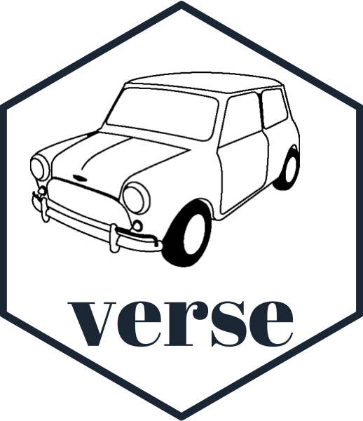
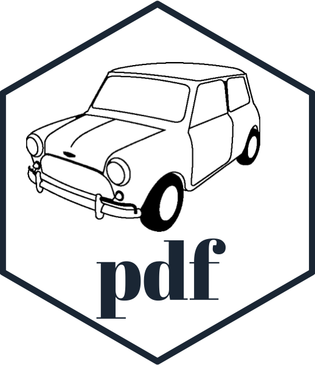

<!-- README.md is generated from README.Rmd. Please edit that file -->

# miniverse 

<!-- badges: start -->


<!-- badges: end -->

The `miniverse` is a constellation of packages for creating documents
within R.

The purpose of this `miniverse` package is to:

1.  Highlight the common interface used across the packages
2.  Provide links to the various packages

## Installation

You can install `miniverse` from
[GitHub](https://github.com/coolbutuseless/miniverse) with:

``` r
# install.packages("devtools")
devtools::install_github("coolbutuseless/minipdf")
devtools::install_github("coolbutuseless/minihtml")
devtools::install_github("coolbutuseless/minicss")
devtools::install_github("coolbutuseless/miniverse")
```

|                                                                                                                                                                                                                         |                                                                                                                                                                                                               |                                                                                                                                                                                                                              |
| ----------------------------------------------------------------------------------------------------------------------------------------------------------------------------------------------------------------------- | ------------------------------------------------------------------------------------------------------------------------------------------------------------------------------------------------------------- | ---------------------------------------------------------------------------------------------------------------------------------------------------------------------------------------------------------------------------- |
|  <br/>Create PDF documents<br/><a href="http://github.com/coolbutuseless/minipdf">Github</a><br/> <a href="http://coolbutuseless.github.io/package/minipdf">Online documentation</a> | <br/> Create CSS<br/><a href="http://github.com/coolbutuseless/minicss">Github</a><br/> <a href="http://coolbutuseless.github.io/package/minicss">Online documentation</a> |  <br/> Create HTML documents<br/><a href="http://github.com/coolbutuseless/minihtml">Github</a><br/> <a href="http://coolbutuseless.github.io/package/minihtml">Online documentation</a> |
|  <br/>Create XML documents<br/><a href="http://github.com/coolbutuseless/minixml">Github</a><br/> <a href="http://coolbutuseless.github.io/package/minixml">Online documentation</a> |                                                                                                                                                                                                               |                                                                                                                                                                                                                              |

# High level document description

  - A document is a tree of objects, with a a *document* node at the
    root, and *element* nodes branching from this.
  - A document is represented by a document class e.g. `HTMLDocument()`
  - Each *thing* within a document is represented by an element class
    e.g. `HTMLElement()`
  - Documents and Elements contain:
      - **attributes** - information about the item
      - **children** - nested sub-elements of this element

# Initialising a new document

New documents can usually be initialised in 2 ways:

1.  R6 object initialisation
2.  A function call (which just wraps the R6 initialisation call)

| package  | Document R6 initialisation | Document function init |
| -------- | -------------------------- | ---------------------- |
| minipdf  | `PDFDocument$new()`        | `pdf_doc()`            |
| minicss  | `StyleSheet$new()`         | `css_stylesheet()`     |
| minihtml | `HTMLDocument$new()`       | `html_doc()`           |
| minixml  | `XMLDocument$new()`        | `xml_doc()`            |

# Initialising a bare element

A bare element can usually be initialised in 3 ways:

1.  R6 object initialisation
2.  A function call (which just wraps the R6 initialisation call)
3.  Using a tag helper method which wraps the R6 initialisation call for
    a lot of standard elements. This usually includes autocomplete for
    the arguments for each
element.

| package  | Element R6 initialisation               | Document function init | Helper                              |
| -------- | --------------------------------------- | ---------------------- | ----------------------------------- |
| minipdf  | `PDFCircle$new()`, `PDFRect$new()`, etc | `pdf_doc()`            | `ptag$circle()`, `ptag$rect()`, etc |
| minicss  | `Style$new()`                           | `css_style()`          |                                     |
| minihtml | `HTMLElement$new()`                     | `html_elem()`          | `htag$title()`, `htag$div()`, etc   |
| minixml  | `XMLElement$new()`                      | `xml_elem()`           |                                     |

# Appending an element to an existing element or document

After appending a new element, the returned value is the document that
was being appended to.

| package  | Append bare element to current element        |
| -------- | --------------------------------------------- |
| minipdf  | `PDFCircle$append()`, `PDFRect$append()`, etc |
| minicss  | `Style$append()`                              |
| minihtml | `HTMLElement$append()`                        |
| minixml  | `XMLElement$append()`                         |

# Creating an element directly within an existing element or document

After creating a new element within an existing element, it is the *new*
element that is
returned.

| package  | Create element within existing element (specific) | Create element within existing element (generic) |
| -------- | ------------------------------------------------- | ------------------------------------------------ |
| minipdf  | `PDFDocument$circle()`, `PDFDocument$rect()`, etc |                                                  |
| minicss  |                                                   | `StyleSheet$add()`                               |
| minihtml | `HTMLElement$div()`, `HTMLDocument$title()`, etc  | `HTMLElement$add()`, `HTMLDocument$add()`, etc   |
| minixml  |                                                   | `XMLElement$add()`, `XMLDocument$add()`, etc     |

# Update attributes and Add Child Elements

In general when calling `$update()` on a document or element:

  - Named arguments are added as attributes of the element
  - Unnamed arguments are added as children of the element

| package  | Update attributes and add child elements        |
| -------- | ----------------------------------------------- |
| minipdf  | `PDFCircle$update()`, `PDFRect$update()`, etc   |
| minicss  | `Style$update()`                                |
| minihtml | `HTMLElement$update()`, `HTMLDocument$update()` |
| minixml  | `XMLElement$update()`, `XMLDocument$update()`   |

# Logo

The logo for all the miniverse packages include a drawing of a Mini
Cooper S.
